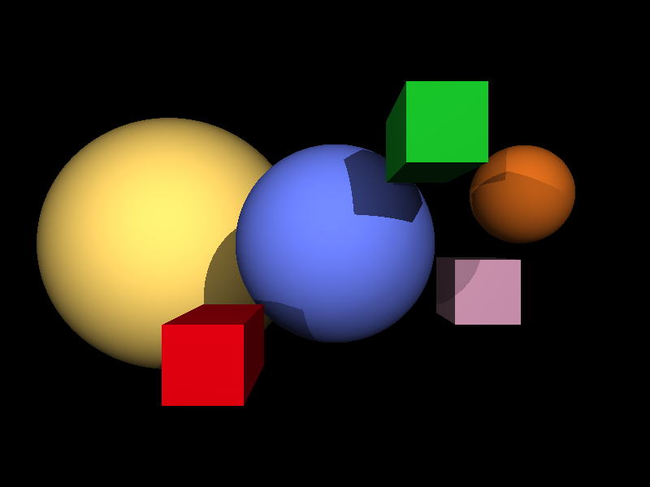

# FSharp DSL for POV

[Persistence of Vision](http://www.povray.org) is a raytracer that has been around for 30 years, producing images or animations from a text based scene language.

This is my entry in the [F# advent calendar 2021](https://sergeytihon.com/2021/10/18/f-advent-calendar-2021/), and is proof of concept of writing a DSL for FSharp to produce POV scene files. I've never tried using the custom operation features of computation expressions, and wanted to have a play after seeing how much the likes of [Farmer](https://github.com/CompositionalIT/farmer) can achieve.

I would have liked to achieved much more, but I work in the health IT sector, and the Covid Omicron situation has meant work was much busier than expected.

An simple example POV scene is below:

```pov
camera {
    location <0,0,0>
    look_at <0,0,10>
}

// Yellow ball
sphere {
    <-6, 0, 20>, 5
    pigment {
        color rgb <0.99, 0.83, 0.40> 
    }
}
```

There are some great example POV scenes files and resultant images in [this repo](https://github.com/spcask/pov-ray-tracing).

Using my hacked together computation expressions, the scene above can be writen in F# as 

```fsharp
render [
  camera {
    location (0,0,0)
    look_at (0,0,10)
  }

  // Yellow ball
  sphere {
    location (-6,0,20)
    radius 5
    pigment (Rgb(0.9,0,0.06))
  }
]
```

The POV language has [macros and lots of features](http://www.povray.org/documentation/3.7.0/r3_0.html), I've only done the bare minimum to get a simple scene represents in F# and rendered. In particular I was interested in exploring how the following new features of F# 6 helped in writing the DSL:

- [Implict conversions](https://devblogs.microsoft.com/dotnet/whats-new-in-fsharp-6/#making-f-simpler-and-more-interoperable-implicit-conversions)
- [As patterns](https://devblogs.microsoft.com/dotnet/whats-new-in-fsharp-6/#making-f-more-uniform-as-patterns)
- [Custom operator overloads](https://devblogs.microsoft.com/dotnet/whats-new-in-fsharp-6/#making-f-more-uniform-overloaded-custom-operations-in-computation-expressions)

The implicit conversions were *really* helpful in not having to worry about overloads for ints vs floats, very nice !.

I also used marker and optional interfaces on F# records which worked out well.


## Code

It's all in one script file with a couple of different modules definited:

- `Model` is the core POV types + a couple of interfaces
- `Builders` is the computation expressions for pov types
- `Serialisation` is responsbile for converting F# types to the POV scene language, it's pretty hacked together
- `Povrary` just shells the pov executable

Windows users can download [the POV binaries](http://www.povray.org/download/), Mac users can `brew install pov`. I've only tested on a Mac, but Windows should work fine if the binary is found on the path.

It can be run with `dotnet fsi Example.fsx`.  It will render an example scene (see image below)

TODO:

- [ ] Some sort of Christmasy scene 🎄
- [ ] Add lots more objects
- [ ] Add common povray command line arguments like image size, anti-aliasing, animations
- [ ] have a pigment builder that works inside other builders (if possible), supports textures, etc
- [ ] tidy up the serilisation overrides

